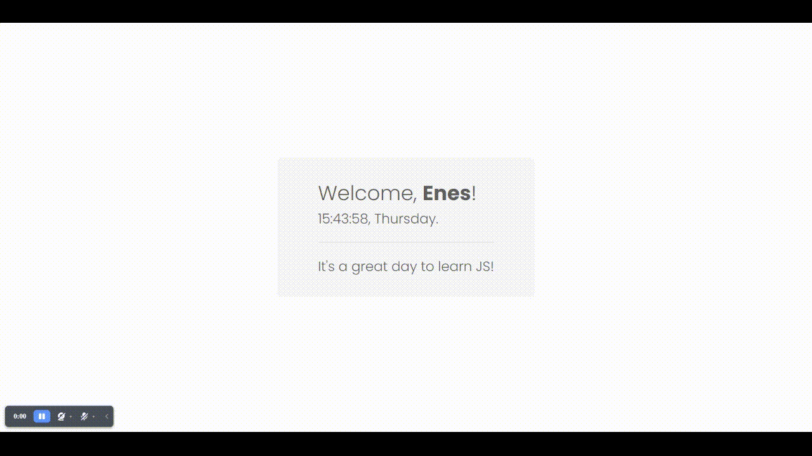

# JS Tasks of JS Course by Patika.Dev

## Task 1: JS Clock

**Summary:**
I took user input via `prompt()` function in this project, and used date functions in js to display time and the day of the week. For the user interface, I only used pure CSS.

**Hint:**
`clamp()` function that I used in CSS file is to make the font-size responsive relative to viewport size. This function takes three arguments. `clamp(min, preferred, max)`

### [Live Demo](https://patika-jstasks.netlify.app/Task-1)

### Preview:

## Task 2: To-Do List App

I built this project for the JS course of Patika.dev platform. This was the last JS task I've done throughout the JS course. As I finally turned this assignment in, I had the right to get a "Beginner Frontend Web Development Path" certificate.

I've learned a lot when I was building this To-do list app.

### [Live Demo](https://patika-jstasks.netlify.app/Task-2)

### Preview:

## Task 3: Asian Kitchen's Menu

**Summary:**
I used `fetch()` function to retrieve data from JSON file and `createElement()` function to create DOM elements dynamically in this project. This project's taught me the fundamentals of creating DOM elements dynamically, and how to structure a JSON file, and how to retrieve data from it. I want to thank [Patika.Dev](https://app.patika.dev/courses/javascript/odev3) for this instructive JS Task.

### [Live Demo](https://patika-jstasks.netlify.app/Task-3)

### Preview:

If you find this repo useful and inspiring, please leave a :star:.
