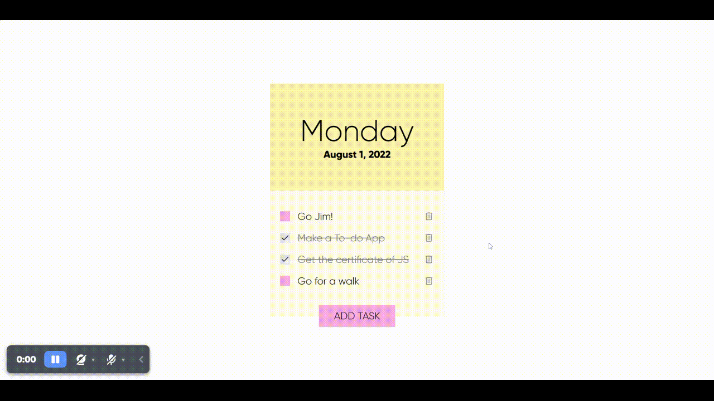

# Task 2: To-Do List App

I built this project for the JS course of Patika.dev platform. This was the last JS task I've done throughout the JS course. As I finally turned this assignment in, I had the right to get a "Beginner Frontend Web Development Path" certificate.

I've learned a lot when I was building this To-do list app.

### [Live Demo](https://patika-jstasks.netlify.app/Task-2){:target="_blank"}

### Preview:

